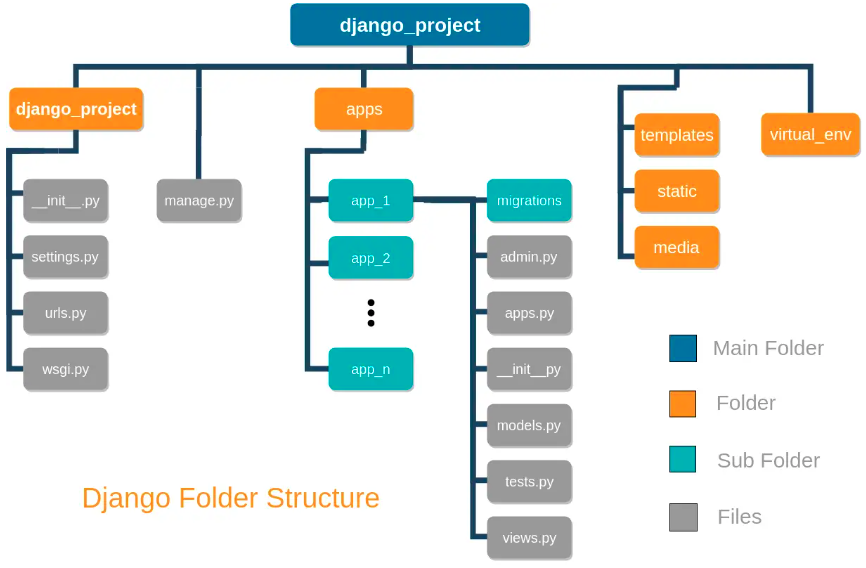

# Super-Project

O objetivo desse projeto é criar um conjunto de códigos envolvendo desenvolvimento web, python, django, html, css, javacript.

## Comandos utilizados na criação desse projeto

1. Inicilamente, crie a pasta do projeto:

```bash
mkdir super-project
cd super-project/
```

1. Se necessário, instale o Python [link](https://www.python.org/downloads/)

1. Verifique a versão instalada do Python (para ter certeza que tudo ocorreu bem):

```bash
python3 --version
```

1. Se necessário, instale o pip:

```bash
sudo apt install python3-pip
```

1. Verifique a versão instalada do pip (para ter certeza que tudo ocorreu bem):

```bash
pip --version
```

1. Se necessário, instale o virtualenv:

```bash
pip install virtualenv
```

1. Verifique a versão instalada do virtualenv (para ter certeza que tudo ocorreu bem):

```bash
virtualenv --version
```

1. Crie o ambiente virtual para isolar as instalações Python:

```bash
virtualenv venv
```

1. Ativei o ambiente virtual para iniciar as instalações de forma isolada:

```bash
source venv/bin/activate
```

1. Quando desejar sair do ambiente virtual, basta digitar:

```bash
venv $ deactivate
```

1. Instale o django dentro do ambiente virtual criado:

```bash
venv $ pip install django
```

1. Verifique a versão instalada do django (para ter certeza que tudo ocorreu bem):

```bash
venv $ django-admin --version
```

1. Crie um projeto em django:

```bash
venv $ django-admin startproject super_project .
```

1. Inicie a execução do projeto django criado:

```bash
venv $ python3 manage.py runserver
```

1. Acesse através do navegdor web a página [http://127.0.0.1:8000/](http://127.0.0.1:8000/). Uma página padrão do django deve aparecer.

1. Crie as seguintes pastas dentro do diretório raiz:

```bash
mkdir static
mkdir media
mkdir templates
mkdir apps
mkdir docs
```

1. A estrutura geral de pastas e arquivos terá a seguinte aparência:



**OBS**: Está estrutura segue o padrão estabelecido em [link](https://studygyaan.com/django/best-practice-to-structure-django-project-directories-and-files).

1. A estrutura geral de pastas e arquivos após digitar o comando de terminal `tree`:

```bash
super-project
.
├── apps
├── db.sqlite3
├── manage.py
├── media
├── README.md
├── static
├── super_project
│   ├── asgi.py
│   ├── __init__.py
│   ├── __pycache__
│   │   ├── ...
│   ├── settings.py
│   ├── urls.py
│   └── wsgi.py
├── templates
└── venv
    ├── bin ...
    │   ...
```

1. Crie as seguintes pastas dentro do diretório `static`:

```bash
mkdir css
mkdir js
mkdir images
mkdir icons
mkdir files
```

1. No arquivo `settings.py` é necessário configurar/definir as seguintes variáveis:

```python
STATIC_URL = 'static/'
STATIC_ROOT = os.path.join(BASE_DIR, 'static')

MEDIA_URL = 'media/'
MEDIA_ROOT = os.path.join(BASE_DIR, 'media')
```

1. No arquivo `settings.py` é necessário configurar/definir o idioma utilizado pela aplicação django:

```python
LANGUAGE_CODE = 'pt-BR'
```

1. No arquivo `settings.py` em `TEMPLATES` é necessário indicar a localização da pasta de templates:

```python
TEMPLATES = [
    {
        'BACKEND': 'django.template.backends.django.DjangoTemplates',
        'DIRS': [os.path.join(BASE_DIR, 'templates')], # inclua o diretório da pasta de templates aqui.
        'APP_DIRS': True,
        'OPTIONS': {
            'context_processors': [
                'django.template.context_processors.debug',
                'django.template.context_processors.request',
                'django.contrib.auth.context_processors.auth',
                'django.contrib.messages.context_processors.messages',
            ],
        },
    },
]
```

1. Inicie a execução do projeto django (veja se está funcionando):

```bash
venv $ python3 manage.py runserver
```

1. Execute o comando abaixo para criar um aplicativo chamado `biblioteca` dentro da pasta `apps` no projeto `super-project`:

```bash
venv $ cd apps/
venv $ django-admin startapp biblioteca
```

o comando abaixo também faz a mesma coisa:

```bash
venv $ cd apps/
venv $ python3 ../manage.py startapp biblioteca
```

1. Execute o comando abaixo para criar um aplicativo chamado `services` dentro da pasta `apps` no projeto `super-project`:

```bash
venv $ cd apps/
venv $ django-admin startapp services
```

1. No arquivo `settings.py` em `INSTALLED_APPS` é necessário indicar onde estão localizadas as aplicações criadas:

```python
INSTALLED_APPS = [
    'django.contrib.admin',
    'django.contrib.auth',
    'django.contrib.contenttypes',
    'django.contrib.sessions',
    'django.contrib.messages',
    'django.contrib.staticfiles',
    'apps.biblioteca', # inclua o app criado aqui
    'apps.services',   # inclua o app criado aqui 
]
```

1. No arquivo `urls.py` dentro da pasta `super_project` é necessário indicar a localização das rotas utilizadas das aplicações:

```python
from django.contrib import admin
from django.urls import path, include
from django.conf import settings
from django.conf.urls.static import static

urlpatterns = [
    path('admin/', admin.site.urls),
    path('biblioteca/', include('apps.biblioteca.urls')), # inclua as rotas das aplicações aqui
    path('services/', include('apps.services.urls'))      # inclua as rotas das aplicações aqui
]

urlpatterns += static(settings.STATIC_URL, document_root=settings.STATIC_ROOT) # adicione também essa linha para localização dos arquivos estáticos
```

1. No arquivo `apps.py` em `biblioteca` é necessário alterar o nome do mesmo indicando que ele é subpasta de `apps`:

```python
from django.apps import AppConfig


class BibliotecaConfig(AppConfig):
    default_auto_field = 'django.db.models.BigAutoField'
    name = 'apps.biblioteca' #aqui tem que ser feita uma alteração, pois não estava indicado o mesmo é subpasta de apps.
```

1. No arquivo `apps.py` em `services` e também quaisquer outras aplicações que forem criadas é necessário alterar o nome do mesmo indicando que ele é subpasta de `apps`:

```python
from django.apps import AppConfig

class ServicesConfig(AppConfig):
    default_auto_field = 'django.db.models.BigAutoField'
    name = 'apps.services' #aqui tem que ser feita uma alteração, pois não estava indicado o mesmo é subpasta de apps.
```

1. Inicie a execução do projeto django (veja se está funcionando):

```bash
venv $ python3 manage.py runserver
```

1. Crie um arquivo de `urls.py` na pasta `biblioteca` com o seguinte conteúdo:

```python
from django.urls import path

from . import views

urlpatterns = [
    path('teste/', views.teste, name='teste'),
]
```

1. Crie um arquivo de `urls.py` na pasta `services` com o seguinte conteúdo:

```python
from django.urls import path

from . import views

urlpatterns = [
    path('teste/', views.teste, name='teste'),
]
```

1. Crie um arquivo de `views.py` na pasta `biblioteca` com o seguinte conteúdo:

```python
from django.shortcuts import render
from django.http import HttpResponse

def teste(request):
    return HttpResponse("Olá Mundo - Biblioteca Teste")
```

1. Crie um arquivo de `views.py` na pasta `services` com o seguinte conteúdo:

```python
from django.shortcuts import render
from django.http import HttpResponse

def teste(request):
    return HttpResponse("Olá Mundo - Services Teste")
```

1. Inicie a execução do projeto django (veja se está tudo funcionando):

```bash
venv $ python3 manage.py runserver
```

OBS: teste as urls: `http://127.0.0.1:8000/biblioteca/teste/` e `http://127.0.0.1:8000/services/teste/`

1. Comando para gerar o arquivo `requirements.txt` com as dependências em Python do projeto criado:

```bash
venv $ pip freeze > requirements.txt
```

1. Caso necessário, para instalar todas as dependências do projeto:

```bash
venv $ pip install -r requirements.txt
```

1. Para criar um superusuário é necessário antes fazer a migração de algumas tabelas padrão do Banco de Dados (BD) do django. Para isso digite o código abaixo:

```bash
venv $ python3 manage.py migrate
```

1. Crie um superusuário chamado `admin` com senha `admin` (o email pode deixar em branco, se desejar):

```bash
venv $ python3 manage.py createsuperuser
```

1. Inicie a execução do projeto django (veja se está tudo funcionando):

```bash
venv $ python3 manage.py runserver
```

1. Entre no endereço [http://127.0.0.1:8000/admin/](http://127.0.0.1:8000/admin/) e faça login com os dados criados: 


## Recursos Utilizados

* Django Framework - [link django project](https://www.djangoproject.com/)

## Instalações


Quando começar a criar os modelos do BD devo executar o código abaixo: OBS: Toda vez que fizer uma modificação no modelo de dados deve-se digitar esse código abaixo pelo que entendi.

```bash
venv $ python3 manage.py makemigrations
```

Nesse comando de fato é feito a criação das tabelas no BD:

```bash
venv $ python3 manage.py migrate
```

Caso você deseje ver o que foi feito no BD, basta digitar o comando abaixo com o número da migração:

```bash
venv $ python manage.py sqlmigrate core 0001
```

Manipulação do BD através do terminal:

```bash
venv $ python manage.py shell
```
